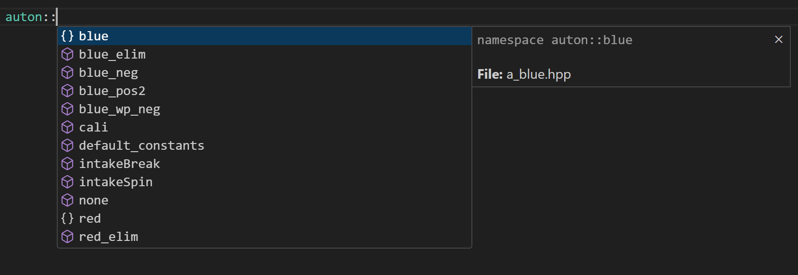
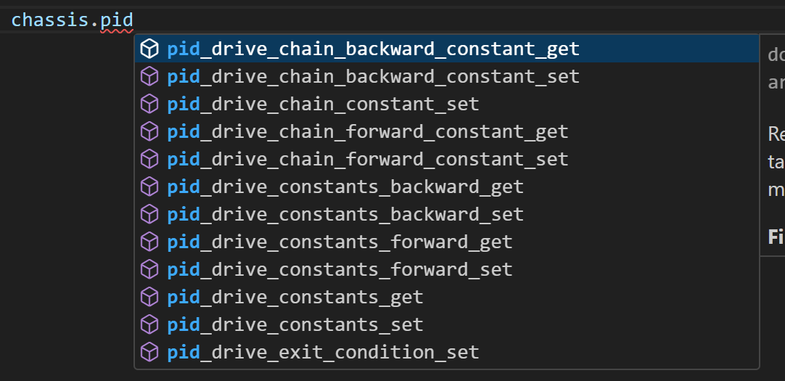

# Files

We use `CPP` to program our robot, this means we have an `include` and `src` folder.

`src` is where the code goes and the `include` folder is for headers and types.

Here are all the files our robot uses that I’ve made

```
include
├── main.h
├── autons.hpp
├── utils.hpp
├── globals.hpp
├── screen.hpp
├── a_blue.hpp
├── a_red.hpp
└── a_skills.hpp
src
├── main.cpp
├── autons.cpp
├── utils.cpp
├── globals.cpp
├── screen.cpp
├── a_blue.cpp
├── a_red.cpp
├── a_skills.cpp
├── --extra files--
├── comicsans.c
└── Spades_No_BG_Small.c
```

# More about me

First, more about me, The programmer for `6627S`.

My name is Charlie, I mainly like to code in JavaScript and I like to use OOP, or Object-oriented programming. While C++ is an OOP language I don’t like how the include system works where it will dump all the function names into the root namespace, this is why I have heavy use of namespaces, namespaces allow me to have blocks of code under a name, most of my files have namespaces for them.

The `autons.cpp` file uses the namespace `auton::` this helps me in programming if I want to call a function from `autons.cpp` I just can put `auton::` and see what functions it has using my IDE and IntelliSense.

# File namespaces

Here are the files and their namespaces:

`a_blue.cpp` uses `auton::blue::`

`a_red.cpp` uses `auton::red::`

`autons.cpp` uses `auton::`

`utils.cpp` uses `utils::`

`screen.cpp` uses `picker::`

# IDE info

The IDE, or integrated development environment, I use is vscode, vsCode is amazing! As it has IntelliSense, This allows me to see what functions something has quickly.



It will also show me when something is wrong and if my code is written wrong or isn’t complete (as seen, the PID is underlined in red)



This just helps me stay organized while programming our robot.

# utils.cpp

The first file we are going to go over is our `utils.cpp` file, this file is for holding utils that I might call offen, the functions here don’t really fit in anywhere else or it's here by my preference.

One thing in `utils.cpp` is our `AutonHelper`, what's the `AutonHelper`? Well it's a very cool class that I came up with, it has the following functions `addAuton`, `getName`, `listAutons`, `getCount`, `getRGB`, `getAutons`, `runAuton`, `getAutonDesc`. This helps us make autons more flexible and allows us to quickly make a new one and have it shown on the screen.

```cpp
// Creates an auton helper requires: name, r, g, b
AutonHelper::AutonHelper(const std::string& name, int r, int g, int b): name(name), color{r, g, b} {}

// Add an auton into the group
void AutonHelper::addAuton(const std::string& autonName, std::function<void()> func, const std::string& autonNameDesc) {
  autons.emplace_back(autonName, func);
  autonsDesc.emplace_back(autonName, autonNameDesc);
}

// Get the name of the current auton group
std::string AutonHelper::getName() const {
  return name;
}

// Returns the count of autonomous routines
size_t AutonHelper::getCount() const {
  return autons.size();
}

// Get the RGB color for this Auton (used in screen.cpp)
std::tuple<int, int, int> AutonHelper::getRGB() const {
  return std::make_tuple(color.r, color.g, color.b);
}

// Get auton functions
std::vector<std::pair<std::string, std::function<void()>>> AutonHelper::getAutons() const {
  return autons;
}

// Get auton descriptions
std::vector<std::pair<std::string, std::string>> AutonHelper::getAutonsDesc() const {
  return autonsDesc;
}

// Runs a specific auton by its name
bool AutonHelper::runAuton(const std::string& autonName) const {
  for (const auto& [name, func] : autons) {
    if (name == autonName) {
      func();
      return true;
 }
 }
  return false;
}

// Returns the description of the auton requested
std::string AutonHelper::getAutonDesc(const std::string& autonName) const {
  for (const auto& [name, desc] : autonsDesc) {
    if (name == autonName) {
      return desc;
 }
 }
  return ":(";
}
```

The `utils.cpp` file also has `createAutons` and `getAutons`, in the file we also have a vector called `autons`, after `createAutons` makes the autons we add them to this vector, this vector is then sent back when `getAutons` is called.

```cpp
// Stores created autons
std::vector<AutonHelper> autons;

// Creates autons
std::vector<AutonHelper> utils::createAutons() {

 // Create "Blue" Autons
 AutonHelper blue("Blue", 0,0,255);
  blue.addAuton("pos", auton::blue::pos,"Pos\nx - ring\nx - tops");
  blue.addAuton("neg", auton::blue::neg,"Neg\nx - ring\nx - tops");
  blue.addAuton("neg_wp", auton::blue::neg_wp,"Neg (WP) Win Point\nx - ring\nx - tops");
  blue.addAuton("neg_elim", auton::blue::neg_elim,"Neg Elim\nx - ring\nx - tops");

 // Create "Red" Autons
 AutonHelper red("Red", 255,0,0);
  red.addAuton("pos", auton::red::pos,"Pos\nx - ring\nx - tops");
  red.addAuton("neg", auton::red::neg,"Neg\nx - ring\nx - tops");
  red.addAuton("neg_wp", auton::red::neg_wp,"Neg (WP) Win Point\nx - ring\nx - tops");
  red.addAuton("neg_elim", auton::red::neg_elim,"Neg Elim\nx - ring\nx - tops");

 // Create "Skills" Autons
 AutonHelper skills("Skills", 204,204,0);
  skills.addAuton("SkillsV3", auton::skills::skillsv3,"Skills V3\nI hate (mondays) skills....");

 // Add the AutonHelpers to the autons
 autons = {blue, red, skills};
  return autons;
}

// Return the autons
std::vector<AutonHelper> utils::getAutons() {
  return autons;
}
```

Ok… but what is this `AutonHelper` used for??

# screen.cpp

It is used in our `main.cpp`, and our `screen.cpp` files, I will first cover our `screen.cpp` file, this file is what adds everything to our brain screen, from our logo to all the autons, this file does it all, we also use the `Spades_No_BG_Small.c` and `comicsans.c` files in the `screen.cpp` file.

`Spades_No_BG_Small.c` is for our logo.

`comicsans.c` is for our font

## render

The first function is `render`, this function renders out all the elements on the screen using LVGL. We first make a style and apply comic sans to this style. Now we make the MAIN tabs that we use, this being Autons and Debug after that we call renderAuton and renderDebug we then add our logo to the main screen, if we add it to mainTabView it will not be shown on ALL the screens and will vanish.

```cpp
void picker::render(void) {
    static lv_style_t style;
    lv_style_init(&style);
    lv_style_set_text_font(&style, &comicsans);

    mainTabView = lv_tabview_create(lv_scr_act(), LV_DIR_TOP, 30);

    lv_obj_t * tab_btns = lv_tabview_get_tab_btns(mainTabView);

    lv_obj_t * autonsTab = lv_tabview_add_tab(mainTabView, "Autons");
    lv_obj_t * debugTab = lv_tabview_add_tab(mainTabView, "Debug");

    renderAuton(autonsTab);
    renderDebug(debugTab);

    // Non tab based stuff

    lv_obj_t * img = lv_img_create(lv_scr_act()); // Create an image object on the active screen

    /* Set the image source */
    lv_img_set_src(img, &Spades_No_BG_Small); // Use the image data declared in SpadesBG.c
    lv_obj_align(img, LV_ALIGN_BOTTOM_RIGHT, 0, 0);
    pros::Task::create(updater);
}
```

## renderAuton

Now onto our `renderAuton` function, this function renders out our autons

The first step is to disable some default LVGL padding

```cpp
lv_obj_set_style_pad_all(autonsTab, 0, 0);
```

Next, we need to set the place where the "Buttons" (or tabs) will live, and the content

```cpp
autonTabView = lv_tabview_create(autonsTab, LV_DIR_LEFT, 55);
lv_obj_t * tab_content = lv_tabview_get_content(autonTabView);
```

Now we set some styling, such as making scrolling disabled and setting the background to `0,0,0`

```cpp
lv_obj_clear_flag(tab_content, LV_OBJ_FLAG_SCROLLABLE);
lv_obj_set_style_bg_color(autonTabView, lv_color_make(0, 0, 0), 0);
```

Next, we get all our autons

```cpp
std::vector<AutonHelper> autons = utils::getAutons();
```

Now we have a vector full of our `AutonHelper`s, we need to loop through this.

```cpp
for (const auto& autonInfo : autons) {
}
```

Inside this loop we get the auton name, create a tab, set some padding, and create the content for the tab group named `tabView`

We also add the `tabView` to a `tabs` vector pair, we will use this later.

```cpp
std::string name = autonInfo.getName();
lv_obj_t * tab = lv_tabview_add_tab(autonTabView, name.c_str());
lv_obj_set_style_pad_all(tab, 0, 0);

lv_obj_t * tabView = lv_tabview_create(tab, LV_DIR_TOP, 40);
tabs.emplace_back(name, tabView);
```

Now we get the RGB color we set and set the background to that color

```cpp
auto [r, g, b] = autonInfo.getRGB();
lv_obj_set_style_bg_color(tabView, lv_color_make(r, g, b), 0);
```

Next we check if we are doing the `Red` or `Blue` auton group, depending on what we are doing we set `maxBlue` or `maxRed` to the number of autons the `AutonHelper` has for this group

```cpp
if (name == "Blue") maxBlue = autonInfo.getCount();
if (name == "Red") maxRed = autonInfo.getCount();
```

Now we have all the tabs for the Auton groups we have, that means we have a `Blue`, `Red` and `Skills` tabs shown on our brain screen

Now we need to add the autons that each auton group has, we do that by making anthor for loop and calling `getAutons` from our `AutonHelper`

```cpp
for (const auto& auton : autonInfo.getAutons()) {
}
```

In that for loop we make the tab for that auton, create a label and set the label's text to the desciption of the auton using `getAutonDesc` from our `AutonHelper`

```cpp
lv_obj_t * autonTab = lv_tabview_add_tab(tabView, auton.first.c_str());

lv_obj_t * autonLabel = lv_label_create(autonTab);
lv_label_set_text(autonLabel, autonInfo.getAutonDesc(auton.first).c_str());  
```

Putting this all together we get

```cpp
void renderAuton(lv_obj_t * autonsTab) {
    lv_obj_set_style_pad_all(autonsTab, 0, 0);

    autonTabView = lv_tabview_create(autonsTab, LV_DIR_LEFT, 55);
    lv_obj_t * tab_content = lv_tabview_get_content(autonTabView);

    lv_obj_clear_flag(tab_content, LV_OBJ_FLAG_SCROLLABLE);

    lv_obj_set_style_bg_color(autonTabView, lv_color_make(0, 0, 0), 0); // rgb(0, 0, 0)

    lv_obj_t * tab_btns = lv_tabview_get_tab_btns(autonTabView);

    std::vector<AutonHelper> autons = utils::getAutons();
   
    for (const auto& autonInfo : autons) {
        std::string name = autonInfo.getName();
        lv_obj_t * tab = lv_tabview_add_tab(autonTabView, name.c_str());
        lv_obj_set_style_pad_all(tab, 0, 0);

        if (name == "Blue") maxBlue = autonInfo.getCount();
        if (name == "Red") maxRed = autonInfo.getCount();

        lv_obj_t * tabView = lv_tabview_create(tab, LV_DIR_TOP, 40);
        tabs.emplace_back(name, tabView);

        auto [r, g, b] = autonInfo.getRGB();
        lv_obj_set_style_bg_color(tabView, lv_color_make(r, g, b), 0);

        // Add pos, neg, etc... autons to tabs
        for (const auto& auton : autonInfo.getAutons()) {
            lv_obj_t * autonTab = lv_tabview_add_tab(tabView, auton.first.c_str());
   
            lv_obj_t * autonLabel = lv_label_create(autonTab);
            lv_label_set_text(autonLabel, autonInfo.getAutonDesc(auton.first).c_str());
            pros::delay(1);
        }
        pros::delay(5);
    }

}
```

## next

Next onto our `next` funtion, this funtion switches the tab we are looking at to the next one, this is where the `maxBlue` and `maxRed` come in to be used

First we make sure animations are off and we also get the current main tab group we are on, this will be either the `Red`, `Blue` or `Skills` tab

```cpp
lv_tabview_set_act(mainTabView, 0, LV_ANIM_OFF);

uint16_t activeAutonTab = lv_tabview_get_tab_act(autonTabView);
```

We now use a switch funtion, its like a `if` function but it checks if a variable matches one of the `cases` defined

```cpp
switch (activeAutonTab) {
    case 0: {
        // blue auton
    }
    case 1: {
        // red auton
    }
}
```

Wait! Why don't we have `Skills`, well we don't want to select skills when using the `next` function, if we want to run the `Skills` autons we will select it via the brain screen

Now for the cases, both cases are the same code, the only thing that changes is the color we are using/checking/switching to

This is where are `tabs` vector that we made in `renderAuton` come in

`tabs[0]` is the blue tab, `tabs[1]` is the red tab

First we get auton tab we are on, `Blue` in this case, this makes it so we can just do `blueTab` and not have to type out `tabs[0].second`

```cpp
lv_obj_t * blueTab = tabs[0].second;
```

Next we get the tab we are on, this will be one of the autons we have for that color

```cpp
uint16_t activeBlueTab = lv_tabview_get_tab_act(blueTab);
```

We then add 1 to this by doing

```cpp
activeBlueTab++;
```

Next we check if we are at the max autons we have for this group

```cpp
if (activeBlueTab == maxBlue) {}
```

If we are we set the current auton we are on to `0` this will select the first auton for this color, next we set the tab color we are on to `1` this means we go from the `Blue` tab to the `Red` tab

```cpp
lv_tabview_set_act(blueTab, 0, LV_ANIM_OFF); // Set the auton we are on to the first one
lv_tabview_set_act(autonTabView, 1, LV_ANIM_OFF); // Set the auton tab we are on to 1, aka Blue
break; // Leave switch function
```

If we aren't at the max autons then we want to switch to the next auton tab

```cpp
lv_tabview_set_act(blueTab, activeBlueTab, LV_ANIM_OFF);
break;
```

Putting all this together we get the following

```cpp
void picker::next() {
    lv_tabview_set_act(mainTabView, 0, LV_ANIM_OFF);

    uint16_t activeAutonTab = lv_tabview_get_tab_act(autonTabView);

    switch (activeAutonTab) {
        case 0: {
            lv_obj_t * blueTab = tabs[0].second;
            uint16_t activeBlueTab = lv_tabview_get_tab_act(blueTab);
            activeBlueTab++;
            if (activeBlueTab == maxBlue) {
                lv_tabview_set_act(blueTab, 0, LV_ANIM_OFF);
                lv_tabview_set_act(autonTabView, 1, LV_ANIM_OFF);
                break;
            } else {
                lv_tabview_set_act(blueTab, activeBlueTab, LV_ANIM_OFF);
                break;
            }
        }
        case 1: {
            lv_obj_t * redTab = tabs[1].second;
            uint16_t activeRedTab = lv_tabview_get_tab_act(redTab);
            activeRedTab++;
            if (activeRedTab == maxRed) {
                lv_tabview_set_act(redTab, 0, LV_ANIM_OFF);
                lv_tabview_set_act(autonTabView, 0, LV_ANIM_OFF);
                break;
            } else {
                lv_tabview_set_act(redTab, activeRedTab, LV_ANIM_OFF);
                break;
            }
        }
    }
}
```

# main.cpp

The `main.cpp` file where everything comes together.

## initialize

The first function run when the robot is started is the `initialize` function, this is one of the most vitial functions on the robot

```cpp
void initialize() {
 // code...
}
```

First we create all of our `AutonHelper`s

```cpp
m_autons = utils::createAutons();
```

Next we render our screen onto the brain

```cpp
picker::render();
```

Now we create a task to listen to the button presses from the limit switch

```cpp
pros::Task::create(autonSelc);
```

Wait! Why do we use a task for the `autonSelc`? Well code like a river, if a log get stuck then no more water will come out

In this example, the `while(true) {}` is the log and will stop the river from flowing, I will show the `while(true) {}` loop after

Next we do something werid, there is a problem in LVGL where the screen will stop listening for touches, this next code block is ment to minumimise this problem, we run this code during interviews so we can show our brain screen working without having to have a comp switch

```cpp
if (noCode) return;
```

Next we clean up some pistons and make sure they are off, we also reset our two bar rational sensor.

```cpp
ringGrab.set_value(0);
goalGrab.set_value(0);
twoBarRot.reset_position();
```

Next we set our two bar PID as well as set its exit conditions and set the motor brake mode

```cpp
liftPID.constants_set(0.03, 0, 0.04);
liftPID.exit_condition_set(80, 2, 250, 10, 500, 500);
twoBar.set_brake_mode(pros::E_MOTOR_BRAKE_HOLD);
```

Next we set some ez template configs

```cpp
chassis.opcontrol_curve_buttons_toggle(false);
chassis.opcontrol_drive_activebrake_set(0);
chassis.opcontrol_curve_default_set(1, 1);
```

Now we set auton constants

```cpp
auton::default_constants();
```

Lastly we reset the IMU and drive motor encoders and then vibrate the controller when we are done

```cpp
chassis.drive_imu_calibrate(false);
chassis.drive_sensor_reset();
 
master.rumble("-");
```

If we put all this togteher we get

```cpp
void initialize() {
 m_autons = utils::createAutons();
  picker::render();
  pros::Task::create(autonSelc);

  if (noCode) return;

  ringGrab.set_value(0);
  goalGrab.set_value(0);
  twoBarRot.reset_position();

  liftPID.constants_set(0.03, 0, 0.04);
  liftPID.exit_condition_set(80, 2, 250, 10, 500, 500);
  twoBar.set_brake_mode(pros::E_MOTOR_BRAKE_HOLD);

  chassis.opcontrol_curve_buttons_toggle(false);
  chassis.opcontrol_drive_activebrake_set(0);
  chassis.opcontrol_curve_default_set(1, 1);

  auton::default_constants();

  chassis.drive_imu_calibrate(false);
  chassis.drive_sensor_reset();
 
  master.rumble("-");
}
```

## autonomous

Next is our `autonomous` function.

```cpp
void autonomous() {}
```

First we check if we are just in interView mode, we set `runningAuton` to `true` and tell the `twobar` to STOP

```cpp
if (noCode) return;
runningAuton = true;
twoBar.brake();
```

Next we reset the pid, drive and IMU, as well as set the drive mode to `HOLD`

```cpp
chassis.pid_targets_reset();
chassis.drive_imu_reset();
chassis.drive_sensor_reset();
chassis.drive_brake_set(MOTOR_BRAKE_HOLD);
```

Now we start our twoBar PID controller so we can use the twoBar during our autons

```cpp
pros::Task::create(lift_task);
```

Now for the auton part, first we get the selected auton on the screen, this returns a vector of 2 numbers, the first number is what color tab we are on, the second number is what auton we are running

```cpp
std::vector<uint16_t> auton = picker::getAuton();
uint16_t autonColor = auton[0];
uint16_t autonType = auton[1];
```

If we combine these we can get the autonColor and the autonType we want to run, calling the `second()` fucntion will actully run the auton we have selected.

```cpp
m_autons[autonColor].getAutons()[autonType].second();
```

This is what it looks like put together

```cpp
void autonomous() {
  if (noCode) return;
 runningAuton = true;
  twoBar.brake();
  chassis.pid_targets_reset();
  chassis.drive_imu_reset();
  chassis.drive_sensor_reset();
  chassis.drive_brake_set(MOTOR_BRAKE_HOLD);
  pros::Task::create(lift_task);

  std::vector<uint16_t> auton = picker::getAuton();
  uint16_t autonColor = auton[0];
  uint16_t autonType = auton[1];

  m_autons[autonColor].getAutons()[autonType].second();
}
```

## opcontrol

Next is `opcontrol` this is the code that run during driver control, this is also an importation function

```cpp
void opcontrol() {}
```

First we set autonRunning to false and then check if we are running in noCode mode

```cpp
runningAuton = false;
if (noCode) return;
```

We set the drive mode to `COAST` and the twoBar to `HOLD`, setting the twoBar to `HOLD` is purely for safey

```cpp
chassis.drive_brake_set(MOTOR_BRAKE_COAST);
twoBar.set_brake_mode(pros::E_MOTOR_BRAKE_HOLD);
```

Next onto our tasks we create, we make a task for `controllerButtons`, `controllerButtons2` and `lift_task`

```cpp
pros::Task::create(controllerButtons);
pros::Task::create(controllerButtons2);
pros::Task::create(lift_task);
```

Wait! Why do we have two controllerButton tasks? Well, our two bar uses PID, this means when we use our two bar, we have to LOCK anything else from happening until PID is at the set position. So if we had our two bar and the other buttons in the same task, the other buttons wouldn’t work until the two bar is at the rotation we requested from PID, so our intake, clamp and everything else wouldn’t work anymore until PID is done.

The `lift_task` is what does the PID calcs and moves the two bar

Next is the driver loop

```cpp
while (true) {}
```

First thing we do, is check if we AREN'T conencted to a field controller, like vex net, a comp switch or a smart brain

```cpp
if (!pros::competition::is_connected()) {}
```

If we aren't conencted to one then we check if we are pressing `B` and `DOWN`

```cpp
if (master.get_digital(DIGITAL_B) && master.get_digital(DIGITAL_DOWN)) {}
```

But why do we do this? Well with our code we want to be able to quickly test our autons without having to be connected to a comp switch this allows us to do that

When `B` and `DOWN` are pressed the first thing we do is set `runningAuton` to true, we then run the `autonomous` function, now a "LOG" is stuck in our river, we will stay at this point until the `autonomous` function is done running, then we set `runningAuton` to false and reenable the `COAST` drive

```cpp
runningAuton = true;
autonomous();
runningAuton = false;
chassis.drive_brake_set(MOTOR_BRAKE_COAST);
```

After the check for the fleid connection check we do our actal driver control, this is made EASY using ez-template, we use the split mode when driving so we use 2 sticks to drive

The first stick (left stick) is forward and backward, the second stick (right stick) is turing left and right, next we do a short wait defined by ez-template so we don't over load this `while(true){}` loop

```cpp
chassis.opcontrol_arcade_standard(ez::SPLIT);
pros::delay(ez::util::DELAY_TIME);
```

Now if we put this together we get

```cpp
void opcontrol() {
 runningAuton = false;
  if (noCode) return;
  chassis.drive_brake_set(MOTOR_BRAKE_COAST);
  twoBar.set_brake_mode(pros::E_MOTOR_BRAKE_HOLD);
  pros::Task::create(controllerButtons);
  pros::Task::create(controllerButtons2);
  pros::Task::create(lift_task);

  while (true) {
    // Check if we are connected to a field
    if (!pros::competition::is_connected()) {
        // Trigger the selected autonomous routine
        if (master.get_digital(DIGITAL_B) && master.get_digital(DIGITAL_DOWN)) {
            runningAuton = true;
            autonomous();
            runningAuton = false;
            chassis.drive_brake_set(MOTOR_BRAKE_COAST);
        }
    }

    chassis.opcontrol_arcade_standard(ez::SPLIT);
    pros::delay(ez::util::DELAY_TIME); // Don't change
 }
}
```

## controllerButtons

The next function I will cover is `controllerButtons`

```cpp
void controllerButtons() {}
```

Its in a `while(true){}` loop to always be checking we are pressing a button

We first check if we are running an auton with `isRunningAuton`, this will disable the buttons if we are

```cpp
if (isRunningAuton()) {
  pros::delay(100);
  continue;
}
```

Now for each sub system, first is our intake, if we pressing `R1` we run the intake, if we are pressing `R2` we run the intake backwards, if we aren't pressing anything then we stop the intake

If we didn't have the auton check and ran the auton with our custom auton runner the intake would stop if we turned it on via an auton

```cpp
if (masterController.get_digital(pros::controller_digital_e_t::E_CONTROLLER_DIGITAL_R1)) {
  intakeMotor.move(127);
} else if (masterController.get_digital(pros::controller_digital_e_t::E_CONTROLLER_DIGITAL_R2)) {
  intakeMotor.move(-127);
} else {
  intakeMotor.brake();
}
```

Next is our grabGrab or the clamp, first we check if we pressed `L1` if we did we trigger the clamp, if we press `L2` we disable the clamp, this is done using `set_value` on the `goalGrab` varible

```cpp
if (masterController.get_digital_new_press(pros::controller_digital_e_t::E_CONTROLLER_DIGITAL_L1)) {
  goalGrab.set_value(1);
} else if (masterController.get_digital_new_press(pros::controller_digital_e_t::E_CONTROLLER_DIGITAL_L2)) {
  goalGrab.set_value(0);
}
```

Last is our sweeper, its almost the same as our clamp just differnt buttons, `LEFT` turns on the sweeper, `DOWN` turns off the sweeper

```cpp
if (masterController.get_digital_new_press(pros::controller_digital_e_t::E_CONTROLLER_DIGITAL_LEFT)) {
  ringGrab.set_value(1);
} else if (masterController.get_digital_new_press(pros::controller_digital_e_t::E_CONTROLLER_DIGITAL_DOWN)) {
  ringGrab.set_value(0);
}
```

If we put this all together then we get this

```cpp
void controllerButtons() {
    while (true) {
        if (isRunningAuton()) { // Disable buttons if we are running auton
            pros::delay(100);
            continue;
        }

        if (masterController.get_digital(pros::controller_digital_e_t::E_CONTROLLER_DIGITAL_R1)) {
          intakeMotor.move(127);
        } else if (masterController.get_digital(pros::controller_digital_e_t::E_CONTROLLER_DIGITAL_R2)) {
          intakeMotor.move(-127);
        } else {
          intakeMotor.brake();
        }

        if (masterController.get_digital_new_press(pros::controller_digital_e_t::E_CONTROLLER_DIGITAL_L1)) {
          goalGrab.set_value(1);
        } else if (masterController.get_digital_new_press(pros::controller_digital_e_t::E_CONTROLLER_DIGITAL_L2)) {
          goalGrab.set_value(0);
        }

        if (masterController.get_digital_new_press(pros::controller_digital_e_t::E_CONTROLLER_DIGITAL_LEFT)) {
          ringGrab.set_value(1);
        } else if (masterController.get_digital_new_press(pros::controller_digital_e_t::E_CONTROLLER_DIGITAL_DOWN)) {
          ringGrab.set_value(0);
        }

        pros::delay(100);
    }
}
```

## controllerButtons2

Now for our `controllerButtons2` function

```cpp
void controllerButtons2() {}
```

This starts the same as `controllerButtons`, we make a `while (true){}` loop and check if auton is running

```cpp
while (true) {
  if (isRunningAuton()) { // Disable buttons if we are running auton
    pros::delay(100);
    continue;
 }
}
```

Next we have the buttons them selfs, if we press `UP` we set the PID target to be `3100` and then wait for the PID to be done, for PID we don't use desimles so its added to the end of the number, so `10.00` degress would be `1000`

This sets our twoBar into the loading mode so we can load a ring into it.

```cpp
if (masterController.get_digital_new_press(pros::controller_digital_e_t::E_CONTROLLER_DIGITAL_UP)) {
  liftPID.target_set(3100);
  lift_wait();
}
```

Next is the `RIGHT` button, this button scores the ring onto the wall stake, we set the PID to `13500` and then wait for the PID to be done

```cpp
if (masterController.get_digital_new_press(pros::controller_digital_e_t::E_CONTROLLER_DIGITAL_RIGHT)) {
  liftPID.target_set(13500);
  lift_wait();
}
```

If we put this together we get

```cpp
void controllerButtons2() {
  while (true) {
    if (isRunningAuton()) { // Disable buttons if we are running auton
      pros::delay(100);
      continue;
    }

    if (masterController.get_digital_new_press(pros::controller_digital_e_t::E_CONTROLLER_DIGITAL_UP)) {
      liftPID.target_set(3100);
      lift_wait();
    }

    if (masterController.get_digital_new_press(pros::controller_digital_e_t::E_CONTROLLER_DIGITAL_RIGHT)) {
      liftPID.target_set(13500);
      lift_wait();
    }

    pros::delay(100);
  }
}
```

# globals.cpp

## lift_task

Ok great! We can load and score using our two bar, but how do we put the two bar back down? This is done using `lift_task`

```cpp
void lift_task() {}
```

This is what moves the two bar and it also allows us to put the two bar back down, we do both of these in the same function for safey.

First we run all the code in a `while (true) {}` loop so its always running
Next we get the angle of the two bar using the roatioal sensor

```cpp
int angle = getAngle();
```

Now we have the angle of the two bar, now we check if we are pressing `B`, this is how we put the two bar back down

```cpp
if (masterController.get_digital(pros::controller_digital_e_t::E_CONTROLLER_DIGITAL_B)) {}
```

next we check if we are under 10 degress, at 10 degress the two bar is down and if we keep trying to put it down it will cause it to click, if we are then we tell the two bar to go backwards

```cpp
if (angle > 1000) {
  twoBar.move(-127);
}
```

Now we set the angle of the two bar PID to the new two bar angle, we also set `quitTask` to `true` this is used in `lift_wait`

```cpp
angle = getAngle();
liftPID.target_set(angle);
quitTask = true;
```

If we didn't do this then the PID would just put the two bar back to the postion it was told to go and it won't stay down.

Now what do we do if we arne't pressing `B`? We do the PID calculations

```cpp
int wantSpeed = liftPID.compute(angle);
twoBar.move(wantSpeed/1.2);
```

If we put this all together we get

```cpp
void lift_task() {
  while (true) {
    int angle = getAngle();
   
    if (masterController.get_digital(pros::controller_digital_e_t::E_CONTROLLER_DIGITAL_B)) {
      if (angle > 1000) {
         twoBar.move(-127);
       }
       angle = getAngle();
       liftPID.target_set(angle);
       quitTask = true;
    } else {
      int wantSpeed = liftPID.compute(angle);
      twoBar.move(wantSpeed/1.2);
    }
    pros::delay(ez::util::DELAY_TIME);
 }
}
```

## getAngle

Next is our `getAngle` function

```cpp
int getAngle(){}
```

Now we get the angle the ratioal snesor is outputting

```cpp
int angle = twoBarRot.get_position();
```

Due to the rotation sensor being hyper acturate, it might look like 0 degress but it might be at 359.89, this function sets a reset point angle, if we are past the reset point then we set the angle to `0`

```cpp
if (angle > resetValue) angle = 0;
return angle;
```

This looks like

```cpp
int getAngle(){
  int angle = twoBarRot.get_position();
  if (angle > resetValue) angle = 0;
  return angle;
}
```

## lift_wait

Now for `lift_wait`, this function will WAIT untill the PID is done running

```cpp
void lift_wait() {}
```

Now we make a while loop based off getting the PID status

```cpp
while (liftPID.exit_condition({twoBar}, true) == ez::RUNNING) {}
```

Now we do a check to see if we need to stop waitting by doing

```cpp
if (quitTask) return;
```

If we put this together we get

```cpp
void lift_wait() {
  while (liftPID.exit_condition({twoBar}, true) == ez::RUNNING) {
    if (quitTask) return;
    pros::delay(ez::util::DELAY_TIME);
 }
}
```

## Configs

In this file we also define our drive, motors, pistons and our limit switch

We do that like so

```cpp
// Drive setup, LEFT motors, RIGHT motors,  IMU  WheelSize, Drive Speed
ez::Drive chassis({-16,17,-19}, {-13,14,15}, 20, 2.75, 450);

// Controller setup
pros::Controller masterController(CONTROLLER_MASTER);

// Motors
pros::Motor intakeMotor(4, pros::v5::MotorGear::blue, pros::v5::MotorUnits::degrees);
pros::Motor twoBar(-6, pros::v5::MotorGear::red, pros::v5::MotorUnits::degrees);

// Rations
pros::Rotation twoBarRot(1);

// 3 Wire ports
pros::adi::DigitalOut goalGrab('A');
pros::adi::DigitalOut ringGrab('H');
pros::adi::DigitalIn autonButton('C');

// PID
ez::PID liftPID(0.45, 0, 0, 0, "Lift");
```

# autons.cpp

Now for autons.cpp this file is for our autons! It mainly holds some helper functions for `a_blue.cpp`, `a_red.cpp` and `a_skills.cpp`

## default_constants

`default_constants` sets our PID constants for actions

```cpp
void auton::default_constants() {
  master.clear();
  chassis.pid_heading_constants_set(11, 0, 20);
  chassis.pid_drive_constants_set(20, 0, 100);
  chassis.pid_turn_constants_set(3, 0.05, 20, 15);
  chassis.pid_swing_constants_set(6, 0, 65);

  chassis.pid_turn_exit_condition_set(80_ms, 3_deg, 250_ms, 7_deg, 200_ms, 200_ms);
  chassis.pid_swing_exit_condition_set(80_ms, 3_deg, 250_ms, 7_deg, 500_ms, 500_ms);
  chassis.pid_drive_exit_condition_set(80_ms, 1_in, 250_ms, 3_in, 500_ms, 500_ms);

  chassis.pid_turn_chain_constant_set(3_deg);
  chassis.pid_swing_chain_constant_set(5_deg);
  chassis.pid_drive_chain_constant_set(3_in);

  chassis.slew_drive_constants_set(7_in, 80);
}
```

## turn and swing

Some helpers are `turn` and `swing`, they help us flip our autons easily

```cpp
void auton::turn(bool flipped, int degrees) {
  if (flipped) degrees = degrees * -1;
  chassis.pid_turn_set(degrees, TURN_SPEED);
}

void auton::swing(bool flipped, int degrees, int speed) {
  if (flipped) {
    chassis.pid_swing_set(ez::RIGHT_SWING, degrees * -1, SWING_SPEED, speed);
 } else {
    chassis.pid_swing_set(ez::LEFT_SWING, degrees, SWING_SPEED, speed);
 }
}
```

## intakeSpin and intakeBrake

We also have `intakeSpin` and `intakeBrake` This was used for when we had 2 motors for our intake, I kept it in because its faster to type rather then having to use .move

```cpp
void auton::intakeSpin(int voltage) {
  intakeMotor.move(voltage);
}

void auton::intakeBreak() {
  intakeMotor.brake();
}
```

# Colored auton files

As for `a_blue.cpp`, `a_red.cpp` and `a_skills.cpp`, This has the real code that run during auton

Here is the basic layout we use for all those files:

```cpp
#include "a_blue.hpp"

#include "autons.hpp"
#include "globals.hpp"

int B_DRIVE_SPEED = 115;
int B_TURN_SPEED = 90;
int B_SWING_SPEED = 90;

void auton::blue::pos() { }
void auton::blue::neg() { }
void auton::blue::neg_wp() { }
void auton::blue::neg_elim() { }
```

These functions are put in our `createAutons` function in `utils.cpp` and then called in the `autonomous` function in the `main.cpp` file that I talked about first.

One thing that helps use grab goals better is using `pid_wait_util`

```cpp
chassis.pid_drive_set(-18, B_DRIVE_SPEED / 2);
chassis.pid_wait_until(-10);
goalGrab.set_value(1);
chassis.pid_wait();
```

This allows us to grab the goal while we are still moving, if we went to the goal and stopped we would hit the goal and this would cause the goal to be moved, so we drive into the goal and grab it and then come to a stop.

In skills we want to be fast but also grab the goal good, using `pid_wait_until` we are able to slow down before getting to the goal, this makes it so the goal doesn't go flying when we hit it.

```cpp
chassis.pid_drive_set(-22_in, S_DRIVE_SPEED);
chassis.pid_wait_until(-4_in);
chassis.pid_speed_max_set(30);
chassis.pid_wait_until(-16_in);
goalGrab.set_value(1);
chassis.pid_wait();
```

I even told one of our sister teams, `6627B` about this and they love it! This is extermly helpful when grabbing goals and making fast autons!

Some PID functions we use alot:

`pid_turn_set(x,y)` - this sets the PID to turn to `X` at `Y` speed

`pid_drive_set(x,y)` - this sets the PID to go `X` inches and `Y` speed

`pid_wait_until(x)` - this runs the PID until we have `X` inches left

`pid_wait` - this fully runs out the PID currently set

# The end!

That's it for how our code works! Thank you for taking the time to read this!
